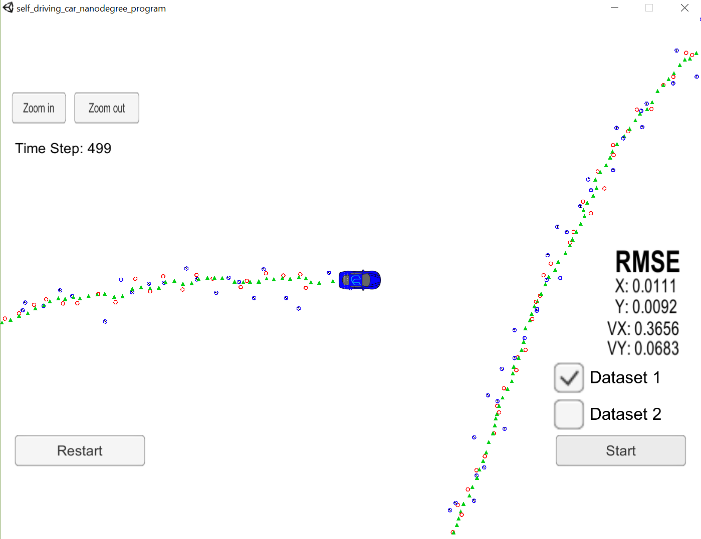

This repo contains classes for estimating the state of a car using either a constant velocity or CTRV model, as well as radar and lidar measurements of the car. The code in this repo is located in the `src` folder. To run the code:

1. Navigate to the build directory of this repo (`cd build`)
2. Build the code: `cmake .. && make`
3. Run it `./UnscentedKF`

There are two options you have when compiling the code, which can be toggled by modifying the `testing` flag in the top-level `CMakeLists.txt` file. Specifically:

1. If `testing = 1`, that is, if `CMakeLists.txt` has the line `set(testing 1)`, then we use the `main` implementation in `src/main_test.cpp`, which reads sensor data from `data/data.txt`. This is the preferred method during debugging since it requires the fewest number of dependencies.
2. If `testing = 0`, that is, if `CMakeLists.txt` has the line `set(testing 0)`, then we use the `main` implementation in `src/main.cpp`, which will await data sent from the [this Udacity simulator](https://github.com/udacity/self-driving-car-sim/releases) using [uWebSocketIO](https://github.com/uWebSockets/uWebSockets).

The top-level folder of this repo contains shell scripts for configuring the dependencies required to run this code on Mac (`install-mac.sh`), or Ubuntu/Windows Bash (`install-ubuntu.sh`). 

If want to run the code in the simulator, then you should follow these steps:

1. Open the simulator, but do not click the `Start` button.
2. Make sure that the `CMakeLists.txt` file has the line `set(testing 0)`.
3. Recompile the code using `cmake .. && make`.
4. Run the EKF using `./UnscentedKF`
5. Press `Start` in the simulator.

When we run the simulator, we get RMSE errors shown here: